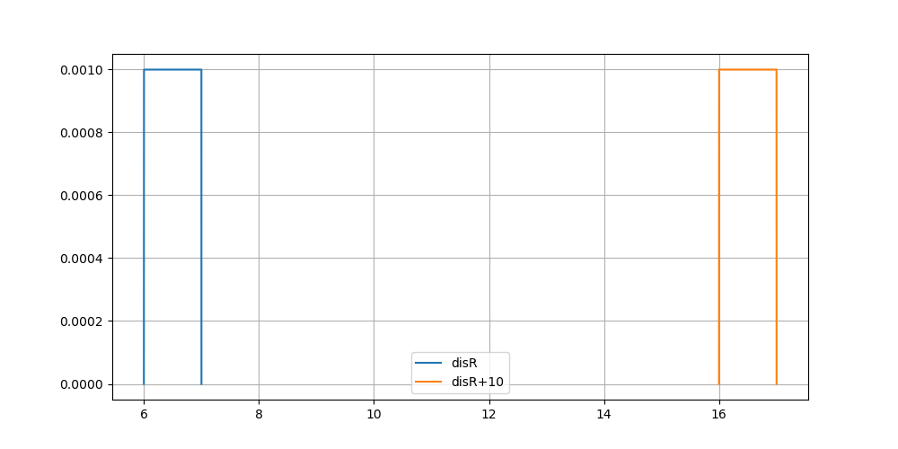
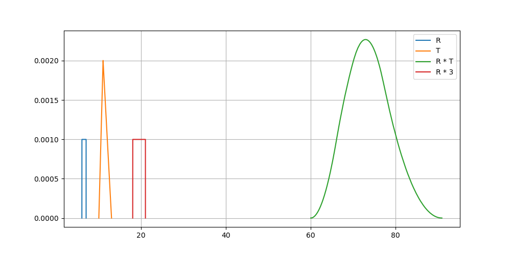
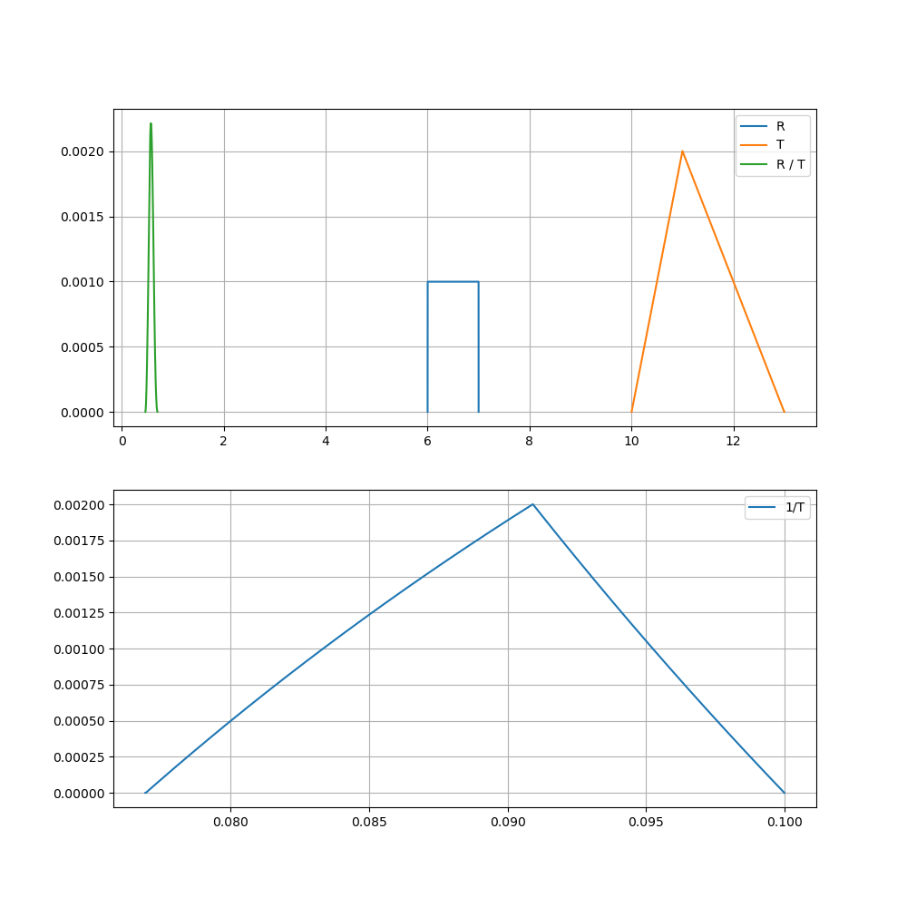

# uncertainDistribution
Python Library for performing calculations of distributions/error distributions

## Motivation TL/DR
You have multiple sticks, you know how accurate they are measured.
The accuracy is defined e.g. by a rectangular "+- 1 percent" window, 
or a normal distribution.
This library allows to define that accuracy types, and add multiple sticks
to get the estimated distribution for the likely total length of the combined sticks.
    
## Features:
One can define multiple distributions:
    Normal Distribution
    Rectangular Distribution
    Triangular Distribution (possibly assymetric)

one can:
    add
    multiply
    divide (if the second distribution is not zero-crossing)

this allows in combination to perform estimations of the probablility 
distribution of complex systems: 
    e.g. to proofe the measurement accuracy of an accredited measurement
        observable = bias_error + sensitivity*set_point/current/length
        where each quantity on the right hand side has individual precission intervals/types
        the bias_error might be normal distributed, while
        the other things are individually rectangular distributed
            
## Technicals
One could do all that using monte carlo sampling and be done.
However it would be slow.
Instead a single distribution is defined by two equally sized arrays
the first one, "centers", is the value of the bin center of the observable, e.g. the stick length
the second one, "weights", is the likelyhood that the corresponding interval 
 would be hit when measuring the random stick with a perfect device.
 
For rect and tri distributions, the centers boundaries are naturally limited.
For a normal distribution one has to choose how much of the tails are resolved

when adding/multiplying/dividing two distributions, all combination of centers are looked at
and the combined likelyhood is defining the new resulting weights.

The Class uses operator overloading, so that + * / with a distributino/scalar are possible

Core functionally is written in c++ for optimization and automatically wrapped to python from "bkUncDist.hpp" using cppyy "https://cppyy.readthedocs.io/en/latest/"


## Usage:
One can define example distributions:
```
from uncertainDistribution import unDist as undi

disN = undi("normal", mean=1, stdDev= 0.1, maxSigma=5)
disR = undi("rect", leftPos=6, rightPos=7)
disT = undi("tri", leftPos=10, centerPos=11,rightPos=13) #note its asymmetric
```


now lets get the sum of two distributions
this is the likelyhood of the sum of random picks from both distributions
this is not an arithmetic plus but a complex algorithm 


```
sumExample1 = disR + disT
sumExample2 = disR + disN

testUndis_sum.png

# we can shift a distribution also by adding a float
sumSkalar = disR+10


# we can multiply distributions
mulRT = disR*disT
mulSkalarR = disR*3

# we can divide distributions
divRT = disR/disT
divTSkal = disT/3
invT = 1/disT
```




    
    

## Requirements 
The library depends on cppyy, numpy, matplotlib
```
pip install cppyy numpy matplotlib
```


